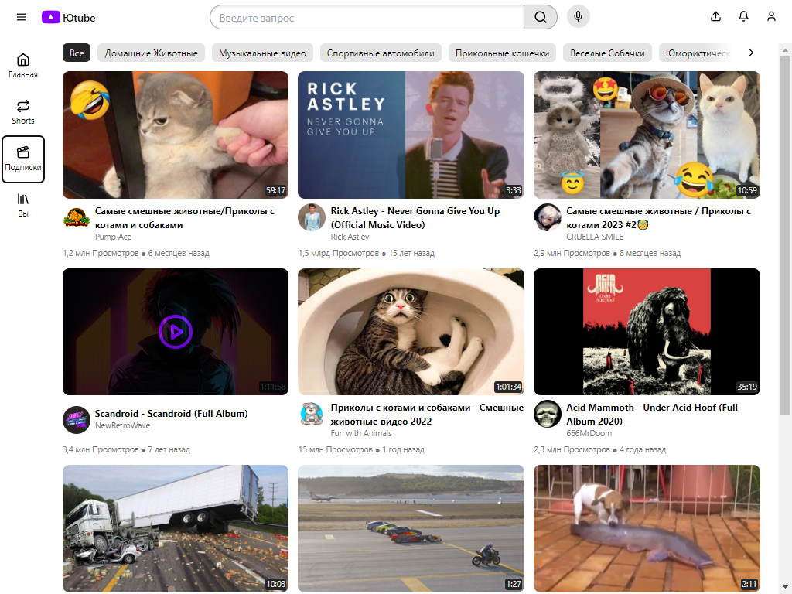

<h1>Youtube на реакте 😆:</h1>
  
 Клон главной страницы ютуба с рабочим плеером, фильтрами и поиском по контенту. 
  

     

   

  
<h2>Как запустить?</h2>

  <h3>Технические требования:</h3>
    1) Node.js >19.7.0
  

  <h3>Установка:</h3>
  
В корне проекта вызываем комманду:

  <pre>npm install</pre>
  <h3>Запуск</h3>
  
После установки в корне проекта вызываем комманду:

  <pre>npm start</pre>
  
После чего проект откроется в вашем браузере по адресу: http://localhost:3000/

  <h2 >Превью:</h2>  
    
)
